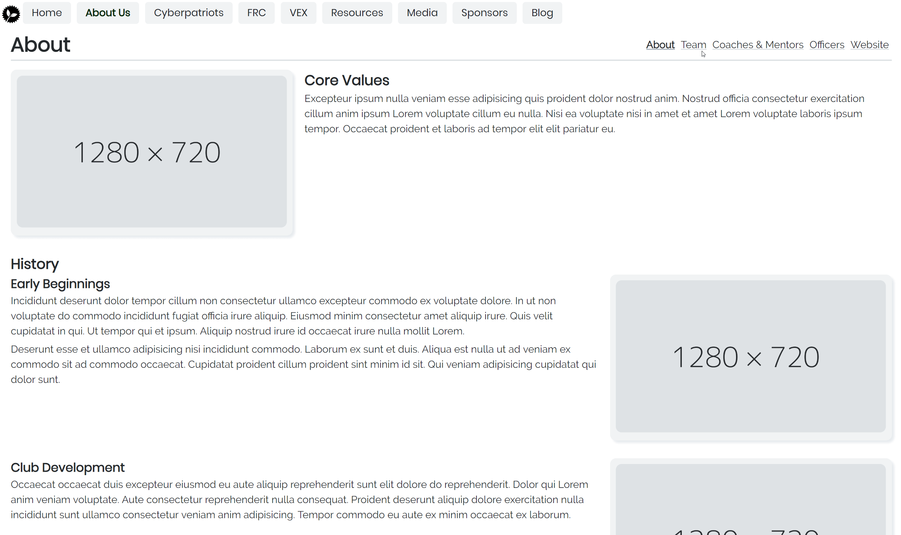
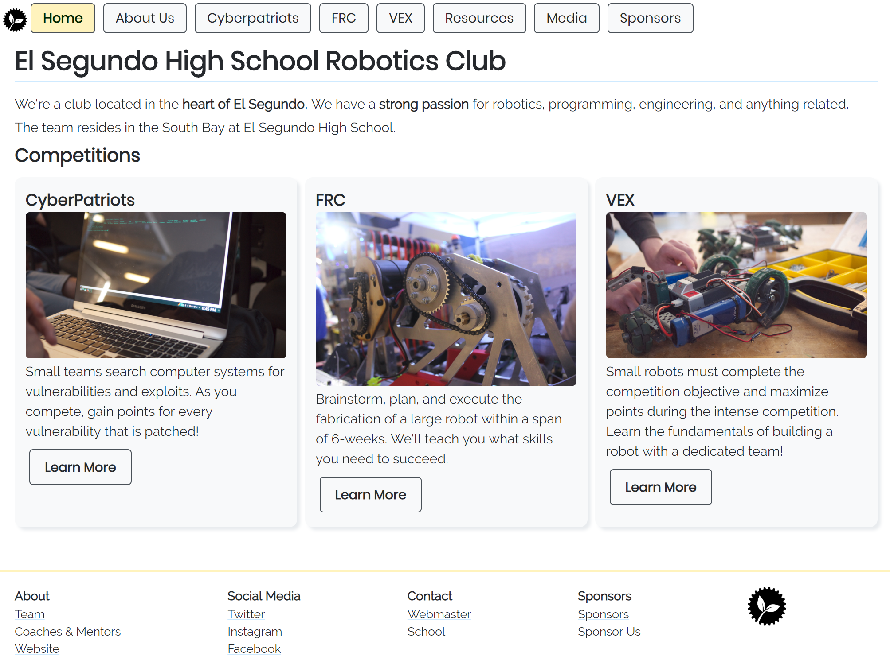
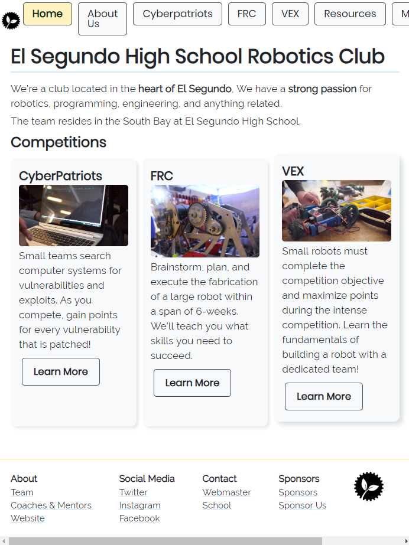
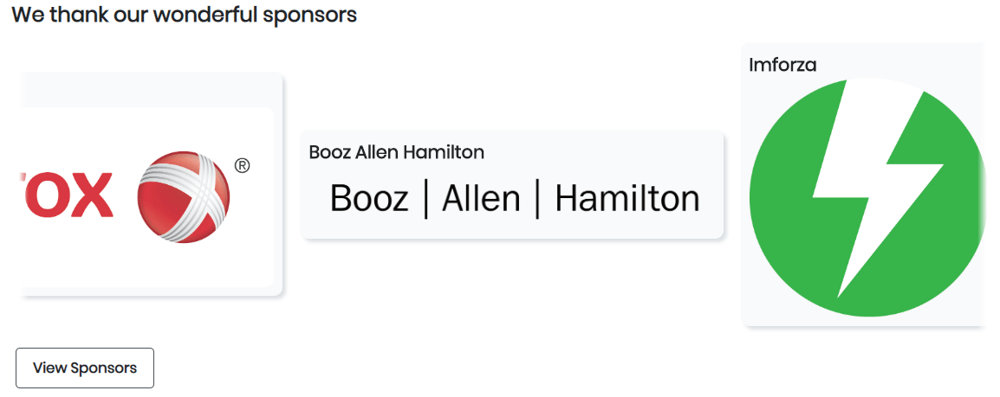

+++
title = "Making a Website for My Robotics Competition"
slug = "creating-website-for-robotics-club"
author = "Edwin Kofler"
date = 2018-11-16T10:10:57-08:00
categories = ["Web"]
tags = ["vue"]
draft = true
+++

During the November of 2018, I became aware of a [website](https://challenges.robotevents.com/challenge/95) competition. Students enrolled in a particular robotics program can submit a website for their robotics program by mid-January. Website creation tools (like ones from Wix or Weebly) were not prohibited. Winners are given gift cards, or something. After learning this, I thought this competition would be perfect to apply the frontend skills I learned the summer before. I knew I probably wasn't going to win, but I wanted to give it my best shot.

Around mid-november I created a new repository and started working. I made sure to use similar tooling / technologies that I had experience with, because I was still sort of new to web development. I used the [VueJS](https://vuejs.org) JavaScript framework. I remember feeling *ecstatic* because Vue-Cli-3 just released. Meaning, I didn't have to create my own Webpack config for Vue + Babel + Sass compiling / transpiling & HMR etc. Gosh, that was a nightmare with my first website.

Before making the first few commits, I remembered the significant lessons I learned from building my first website:
* Make components out of often-repeated "HTML"
* Do not make HTML templates large (split up into as many components as possible)
* Avoid creating large `.scss` stylesheets (so large that they don't fit in their corresponding `.vue` component)

Keeping that in mind, I build a basic page showing what the layout will roughly look like. Nearly everything is grayscale because it helps me focus on the layout, rather than color-matching. All colors are from [Open Color](https://yeun.github.io/open-color).
 
[See commit on GitHub](https://github.com/eshsrobotics/WebsiteChallenge2019/commit/6be6748794d08b85783afcfad2da3a96a132b5f8)

The first thing I remember doing is brainstorming how I would scaffold the project. I remember being rather apprehensive during this time because I only had experience building one other website, which was functionally different. That was the first iteration of my Periodic Table website. So with the lessons I learned from that website and some critical thinking I was able to scaffold a good architecture. It looked something like this initially:

```html
<template>
  <header/>
  <router-view/>
  <footer/>
</template>
```

Where the `<router-view/>` component would be different based on which url you're at, such as `/home` or `/about`.

I remember getting up a MVP fairly quickly. It had a simple header, footer, with a `/home`, `/about`, and more routes. There were not 
`<screenshot/>`

When it came time to choose some sort of UI framework, I opted not to use one. I don't recall the exact reason, but maybe I didn't really like what was out there, or I wanted to learn how to create some of those components on my own. So I custom made all of the components, which sort of slowed down development. I didn't really mind though, that was one of my favorite parts: creating gorgeous elements the user will see. From my last website I learned that colors and icons can really make or break the look of a website. Nearly all of my colors derived from the great [Open Color](https://yeun.github.io/open-color) color pallette. I also used svg icons from [Feather Icons](https://feathericons.com).

I learned my lesson from my earlier website and created *much* smaller components. This made it easier to style the components also. So I didn't end up needing a bunch of `.sass` files for each `.vue` file. That made me satisfied.


A few weeks later:

[See Commit on GitHub](https://github.com/eshsrobotics/WebsiteChallenge2019/commit/c231eee522374eb726cd54279bd5cf16c50be654)


A month later:


[See Commit on GitHub](https://github.com/eshsrobotics/WebsiteChallenge2019/commit/899ae599e5d6d8eeb98bee49f42d0938ccce4681)

Mobile version






As I progressed, a put a lot of features on the roadmap. I planned to include a blogging system, an archive of photos, an archive of videos, and some membership login site. However, I quickly realized those were too many features on my platter. Eventually, I just settled for creating the photo library.

The photo library is probably my favorite feature, and probably the main reason any of the members will visit the website in the future.