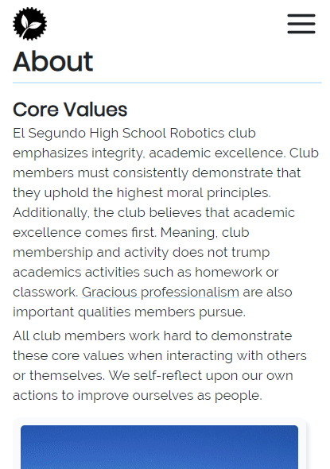

+++
title = "Making a Website for My Robotics Competition"
slug = "creating-website-for-robotics-club"
author = "Edwin Kofler"
date = 2019-04-09T21:23:47-07:00
categories = ["Web"]
tags = ["vue"]
draft = true
+++

During the November of 2018, I became aware of a [website](https://challenges.robotevents.com/challenge/95) competition. Students enrolled in a particular robotics program can submit a website for their robotics program by mid-January. Website creation tools (like ones from Wix or Weebly) were not prohibited. Winners are given gift cards, or something. After learning this, I thought this competition would be perfect to apply the frontend skills I learned the summer before. I knew I probably wasn't going to win, but I wanted to give it my best shot.

Around mid-november I created a new repository and started working. I made sure to use similar tooling / technologies that I had experience with, because I was still sort of new to web development. I used the [VueJS](https://vuejs.org) JavaScript framework. I remember feeling *ecstatic* because Vue-Cli-3 just released. Meaning, I didn't have to create my own Webpack config for Vue + Babel + Sass compiling / transpiling & HMR etc. Gosh, that was a nightmare with my first website.

## Initial Structure
Before making the first few commits, I remembered the significant lessons I learned from building my first website:

* Create components from repeated page elements
* Do not make HTML templates large (split up into as many components as possible)
* Avoid creating large `.css`/`.sass` stylesheets (so large that they don't fit in their corresponding `.vue` component)

Keeping that in mind, I build a basic page showing what the layout will roughly look like. Nearly everything is grayscale because it helps me focus on the layout, rather than color-matching.


[See commit on GitHub](https://github.com/eshsrobotics/WebsiteChallenge2019/commit/6be6748794d08b85783afcfad2da3a96a132b5f8)

As you can see, I did not opt for any UI framework. I don't recall the exact reason, but I think I wanted to learn how to create good-looking components on my own. Even if this slowed down development, I enjoyed creating the components. Besides, it made the website look more unique. From my last website I learned that colors and icons can really make or break the look of a website. Nearly all of my colors derived from the great [Open Color](https://yeun.github.io/open-color) color pallette. Any svg icons you see are from [Feather Icons](https://feathericons.com).

## Navigation Improvements
After a few weeks, I realized the top-level architecture I had previously had to be modified. It looked something like this initially:
If you're not familiar, the `<router-view/>` component changes based on the current URL, such as `/home` or `/about`.

```html
<template>
  <div id="app">
    <navbar />
    <router-view />
    <foot />
  </div>
</template>
```

However, I opted to move the `page-heading` component out of `router-view`. This component consisted of the title of the page, and sub-pages of a route. Previously, I was duplicating the page heading across several components. This seemed wasteful at best, so I refactored to improve the structure.

```html
<template>
  <div id="app">
    <navbar />
    <page-heading />
    <router-view />
    <foot />
  </div>
</template>
```

After I refactored, navigation behaved similarly, with simpler code


[See Commit on GitHub](https://github.com/eshsrobotics/WebsiteChallenge2019/commit/c231eee522374eb726cd54279bd5cf16c50be654)

Since the previous screenshot, I added an actual footer, better animations on the navigation tabs, and placeholder content.

## Improvements
Unfortunately, our team's previous website had little content. So I couldn't really reuse any text or photos. On the plus side, I helped our team organize and upload our photographs to a single GitHub repository a few months before. From there I was able to browse for some photos.

After adding the images, I styled some elements with light blue and yellow, which are our team colors.


[See Commit on GitHub](https://github.com/eshsrobotics/WebsiteChallenge2019/commit/899ae599e5d6d8eeb98bee49f42d0938ccce4681)

Although the desktop version of the site looked pretty good, the mobile version still needed a lot of work. The pictures were too small and the navigation bar was overflowing across the screen.


I fixed this by adding a hamburger menu. Also, I made competition cards fit the width of the screen on smaller devices.



## My favorite parts

### Sponsor carousal

I had the most fun making the carousal that displayed the club's sponsors. After imagining this effect, I found a [repository](https://github.com/biigpongsatorn/vue-infinite-slide-bar) that implemented this feature. For some reason, the scroll effect didn't work unless I put a set width on the element.


### Enlarged photographs


I enjoyed animating the photograph card on hover. You can see it in the gif below: the card hover up, its shadow increases, and the "enlarge" icon fades in and slides to the left.

Creating the page that showed enlarged images was also enjoyable. At the time, I didn't know any best practices that allowed the image to stay on refresh. So, I just base64 encoded the data that described the image in the URI. Because `/` is the last character in the base64 format, it created extra routes that were not intended. As a result, forward slashes were replaced with exclamation marks.

### Photo album

The portion of the website with the most utility is the photo album. Earlier I said that I had to browse for team photos directly through the GitHub interface. By creating this photo gallery, team members can more easily search for photos.


## Conclusion

When I started this project, it wasn't clear to me exactly how the final project will look. As I improved the design, everything looked much more complete. Although I had to drop some features (like a blogging system nad a video album), I absolutely love the final product! I continue to revisit the repository and make incremental changes.