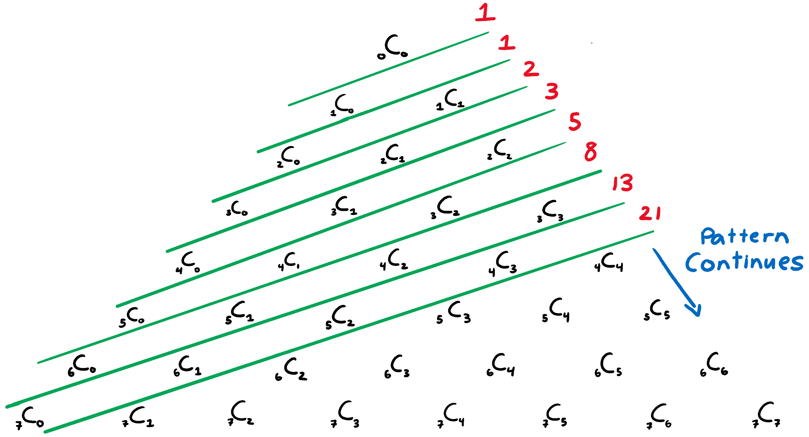
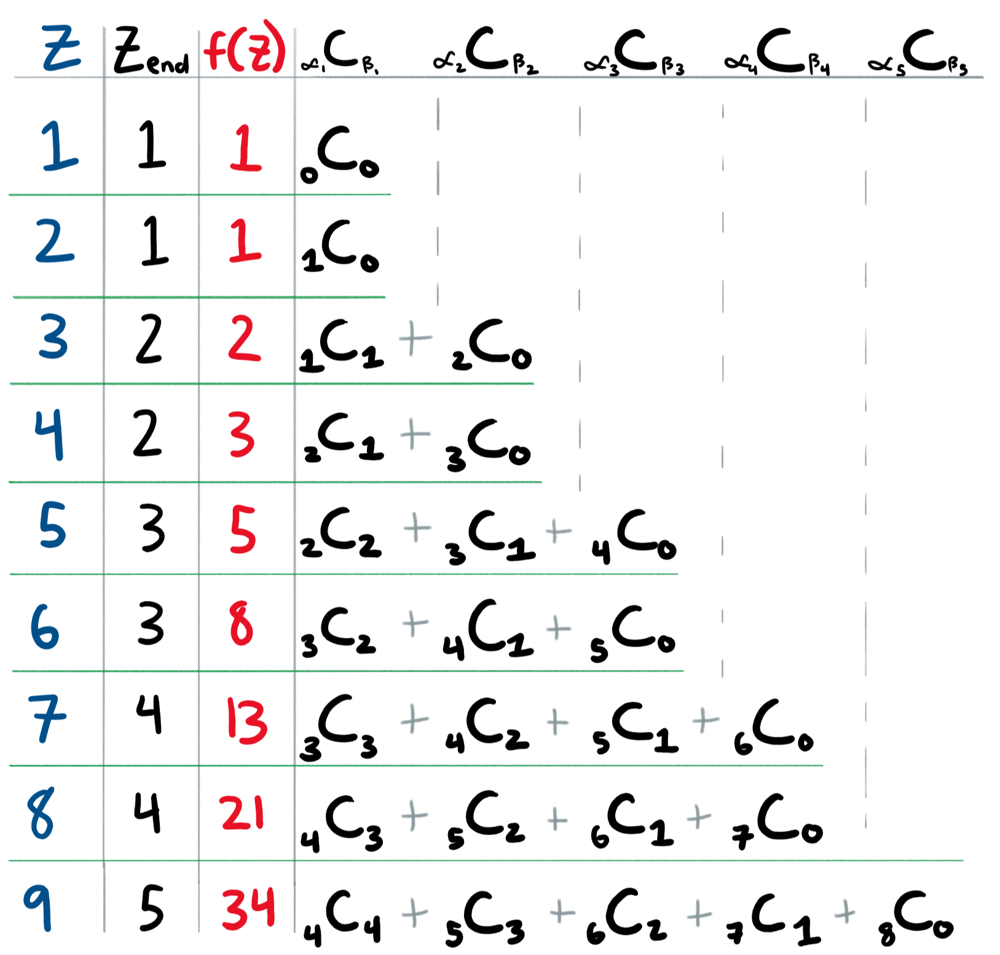

+++
title = "Fibonacci Equation for Nth Term Using Pascal's Triangle (Part 2 of 2)"
slug = "fibonacci-equation-using-pascals-triangle-part-2"
author = "Edwin Kofler"
date = 2018-12-04T22:39:42-08:00
categories = []
tags = []
markup = "mmark"
katex = true
draft = true
+++

If you're not familiar with the intricacies of Pascal's Triangle, see [part 1](http://localhost:1313/blog/fibonacci-equation-using-pascals-triangle-part-1/).

# Finding a Formula

How do we leverage the relationship (in the image above) to obtain an equation that obtains the $$z$$th term ($$Fib(z)$$, or $$F(z)$$) in the Fibonacci sequence? First, we need to figure out what our equation may look like. We know we're adding up terms of the Fibonacci sequence, so a summation symbol will be used. Additionally, we are adding up terms from Pascal's triangle, where each term individually can be written as $$_nC_r$$.

So our final equation will look akin to this:

$$\sum_{\varphi=1}^{z_{end}}{_n}C_k$$

But this is not exactly right, since $$n$$ and $$r$$ are different for each $$z$$th term that's being added up. Therefore, we can more accurately write:

$$\sum_{\varphi=1}^{z_{end}}{_{n(\varphi)}}C_{k(\varphi)}$$

Note that the summation is starting from $$1$$. Also, in this case for Pascal's triangle, $$z$$ starts at 1, so $$z_1 = 1$$ and $$z_2 = 1$$.

I started by reorganizing all the $$_nC_r$$ terms into rows.

One of the first and more obvious patterns is found in the $$Z_{end}$$ column. Rather than increasing by an increment of $$1$$ for every row as the $$Z$$ colum does, it increases by an increment of $$1$$ for every other row.

This is an important pattern because it determines the number of terms being summed.

$$Z_{end} = round(\frac{z}{2})$$

Now, we know we can better describe what the summation might look like

$$f(z) = Fib(z) =\sum_{\varphi=1}^{round(\frac{z}{2})}{_{n(\varphi)}}C_{k(\varphi)}$$

So for $$z = 4$$, $$Z_{end} = 2$$.

$$Fib(z) =\sum_{\varphi=1}^{2}{_{n(\varphi)}}C_{k(\varphi)} =\ _2C_1 +\ _3C_0$$

We only know that $$_2C_1$$ and $$_3C_0$$ are summed due to the table I wrote above. We don't know why $$n(1) = 2$$ or why $$k(2) = 0$$ yet.

No other patterns from that grid really popped out at me. I did see general increment / decrement patterns of $$n(\varphi)$$ and $$k(\varphi)$$ while traversing along rows and columns, but I wasn't sure how to make then dependent on $$\varphi$$ or $$z$$. So I decided to change the structure of the grid. To make it easier to find patterns.