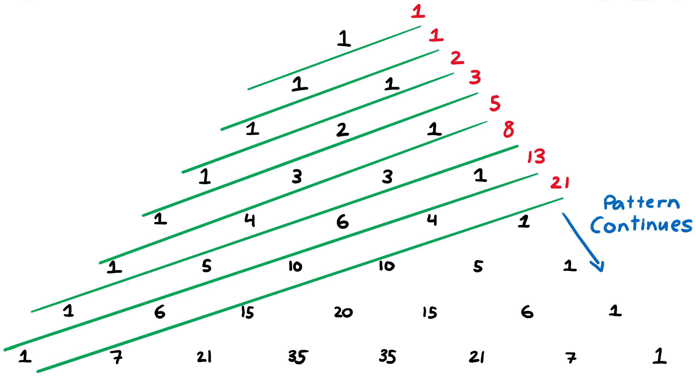
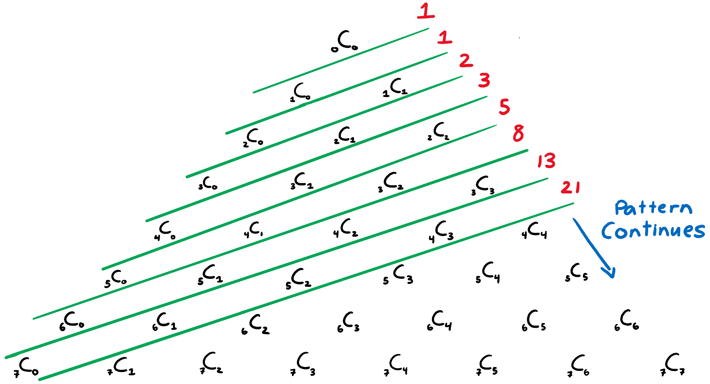

+++
title = "Fibonacci Equation for Zth (Nth) Term Using Pascal's Triangle (Part 1 of 2)"
slug = "fibonacci-equation-using-pascals-triangle-part-1"
author = "Edwin Kofler"
date = 2018-11-16T10:10:57-08:00
categories = ["math"]
tags = ["pascal's triangle", "fibonacci"]
+++

If you're familiar with the intricacies of Pascal's Triangle, see how I did it by going to [part 2](/posts/fibonacci-equation-using-pascals-triangle-part-2/).

# Background of Pascal's Triangle

A while back, I was reintroduced to Pascal's Triangle by my pre-calculus teacher. Pascal's triangle can be written as an infintely expanding triangle, with each term being generated as the sum of the two numbers adjacently above it. For example, both $10$s in the triangle below are the sum of $6$ and $4$. $6$ and $4$ are directly above each $10$.

$$
1 \newline
1 \quad 1 \newline
1 \quad 2 \quad 1 \newline
1 \quad 3 \quad 3 \quad 1 \newline
1 \quad 4 \quad 6 \quad 4 \quad 1 \newline
1 \quad 5 \quad 10 \quad 10 \quad 5 \quad 1 \newline
$$

## Binomial Theorem Relation

My instructor stated that Pascal's triangle strongly relates to the coefficients of an expanded binomial. You've probably seen this before. A binomial to the $n$th power (where $n \in \mathbb{N}$) has the same coefficients as the $n$th row of Pascal's triangle. The overall relationship is known as the [binomial theorem](https://en.wikipedia.org/wiki/Binomial_theorem), which is expressed below.

$$ (a+b)^n = \sum_{k=0}^{n} \binom{n}{k} a^{n-k} b^k $$

$\binom{n}{k}$ means $n$ choose $k$, which has a relation to [statistics](https://en.wikipedia.org/wiki/Binomial_coefficient). As you can see, it's the coefficient of the $k$th term in the polynomial expansion $(a+b)^n$ For example, $n=3$ yields the following:

$$ (a+b)^3 = \sum_{k=0}^{3} \binom{3}{k} a^{3-k} b^{k}$$

$$ a^3 + 3ab^2 + 3a^2b + 9b^3 = \binom{3}{0}a^3 + \binom{3}{1}a^2b + \binom{3}{2}b^2a + \binom{3}{3}b^3 $$

From the above equation, we obtain a cubic equation. Given this, we can ascertain that the coefficient $3$ choose $0$, or $\binom{3}{0}$ = $1$. Below you can see some values we can determine from the operation above.

$$\binom{3}{0} = 1$$
$$\binom{3}{1} = 3$$
$$\binom{3}{2} = 3$$
$$\binom{3}{3} = 9$$

And look at that! The sequence $1\ 3\ 3\ 9$ is on the $3$rd row of Pascal's triangle (starting from the $0$th row).

This binomial theorem relationship is typically discussed when bringing up Pascal's triangle in pre-calculus classes. You might want to be familiar with this to understand the fibonacci sequence-pascal's triangle relationship.

# Pascal's Triangle Representations

Of course, it's not just one row that can be represented by a series of $n$ choose $k$ symbols. The whole triangle can. As you can see, the $3$rd row (starting from $0$) includes $\binom{3}{0}\ \binom{3}{1}\ \binom{3}{2}\ \binom{3}{3}$, the numbers we obtained from the binommial expansion earlier.

$$
\binom{0}{0} \newline
\binom{1}{0} \quad \binom{1}{1} \newline
\binom{2}{0} \quad \binom{2}{1} \quad \binom{2}{2} \newline
\binom{3}{0} \quad \binom{3}{1} \quad \binom{3}{2} \quad \binom{3}{3} \newline
\binom{4}{0} \quad \binom{4}{1} \quad \binom{4}{2} \quad \binom{4}{3} \quad \binom{4}{4} \newline
\binom{5}{0} \quad \binom{5}{1} \quad \binom{5}{2} \quad \binom{5}{3} \quad \binom{5}{4} \quad \binom{5}{5} \newline
$$

Alternatively, Pascal's triangle can also be represented in a similar fashion, using $_nC_k$ symbols. I'll be using this notation from now on.

$$
{_0C_0} \newline
{_1C_0} \quad {_1C_1} \newline
{_2C_0} \quad {_2C_1} \quad {_2C_2} \newline
{_3C_0} \quad {_3C_1} \quad {_3C_2} \quad {_3C_3} \newline
{_4C_0} \quad {_4C_1} \quad {_4C_2} \quad {_4C_3} \quad {_4C_4} \newline
{_5C_0} \quad {_5C_1} \quad {_5C_2} \quad {_5C_3} \quad {_5C_4} \quad {_5C_5} \newline
$$

# Relationship Between Pascal's Triangle and the Fibonacci Sequence

What exactly is this relatiponship? First, draw diagonal lines intersecting various rows of the Fibonacci sequence. Then, add the terms up within each diagronal line to obtain the $z_{th}$ element of the Fibonacci sequence.

The green lines represent the division between each term in the Fibonacci sequence and the red terms represent each $z_{th}$ term, the sum of all black numbers sandwiched within the green borders. In this case, the green lines are initially at an angle of $\frac{\pi}{9}$ radians, and gradually become less steep as $z$ increases.

Like I said, I'm going to be using $_nC_k$ symbols to express relationships to Pascal's triangle, so here's the triangle expressed with different symbols.

We can write the first 5 equations. We want to generate the $_nC_r$ terms using some formula (starting from 1).

$$z_1 = {_0C_0} = 1$$

$$ z_2 = {_1C_0} = z_2 = 1$$

$$z_3 = {_2C_0} + {_1C_1} = 2$$

$$z_4 = {_3C_0} + {_2C_1} = 3$$

$$z_5 = {_4C_0} + {_3C_1} + {_2C_2} = 5$$

$$...$$

Is it possible to succinctly write the $z$th term ($Fib(z)$, or $F(z)$) of the Fibonacci as a summation of $_nC_k$ Pascal's triangle terms? The number of terms being summed up depends on the $z$th term. Both $n$ and $k$ (within $_nC_k$) depend on the value of the summation index (I'll use $\varphi$). See any patterns yet? Note that I'm using $z$th term rather than $n$th term because $n$ is used when representing $_nC_k$. See if you can figure it out for yourself before continuing! This is a great challenge for Algebra 2 / Pre-Calculus students!

See how I did it in [part 2](/posts/fibonacci-equation-using-pascals-triangle-part-2/)!
