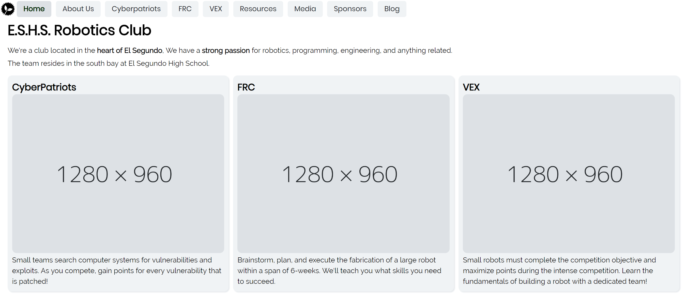
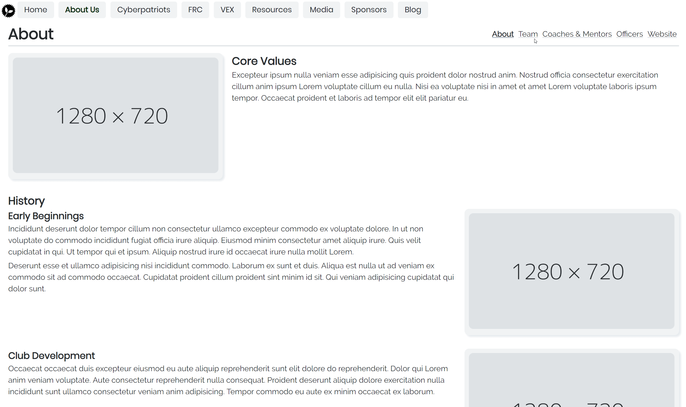
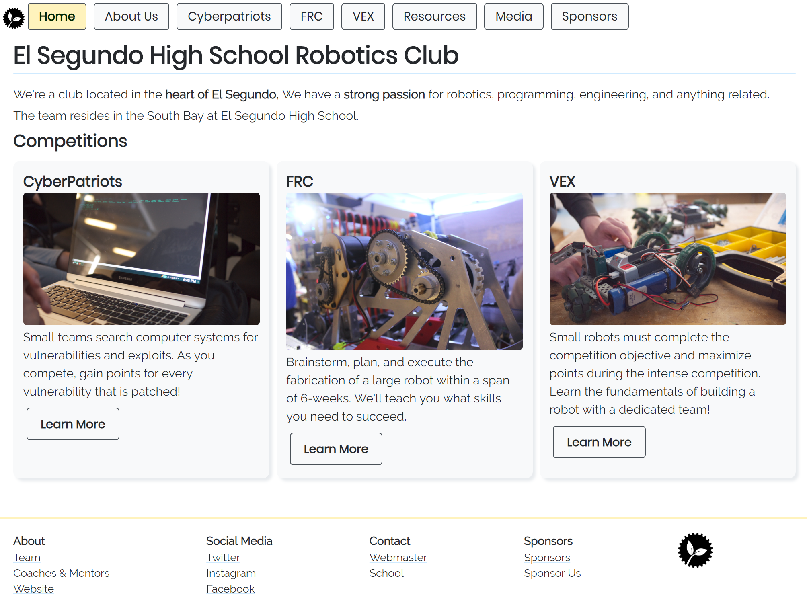
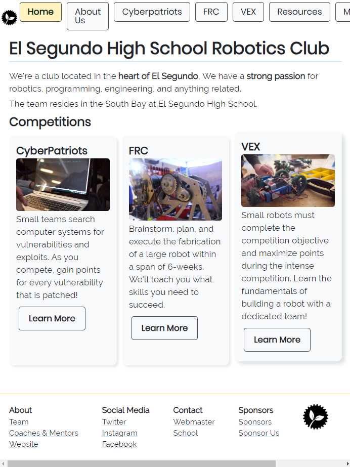
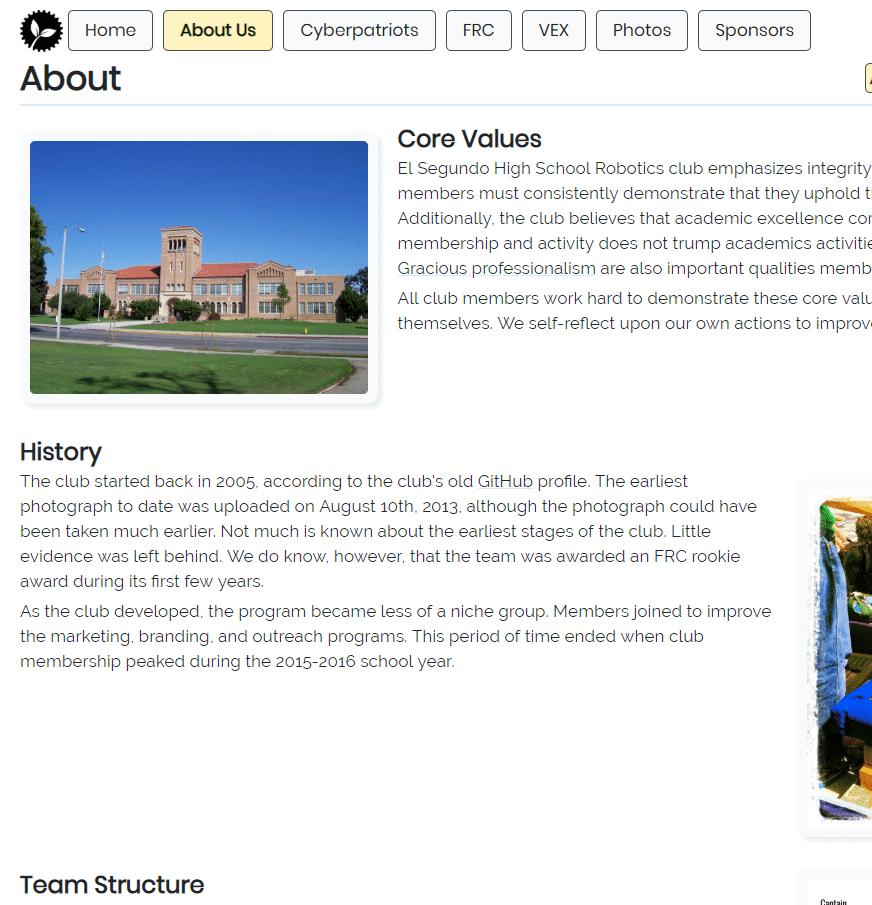
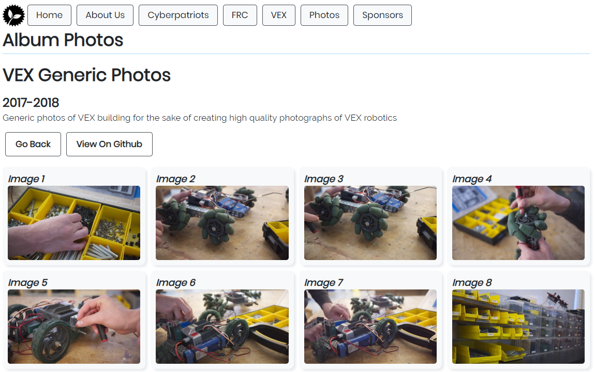

+++
title = "Developing my Robotics Teams' Website"
slug = "creating-website-for-robotics-club"
author = "Edwin Kofler"
date = 2019-05-14T22:58:47-07:00
categories = ["web"]
tags = ["vue", "frontend"]
+++

During the November of 2018, I became aware of a [website](https://challenges.robotevents.com/challenge/95) competition. I had the opportunity to submit a website that showcased my robotics club by mid-January. Website creation tools (like ones from Wix or Weebly) were not prohibited. After learning this, I thought this competition would be perfect to apply the frontend skills that I recently learned! I knew I probably wasn't going to win, but I wanted to give it my best shot.

So I created a new repository that November and started working. I made sure to use similar tooling / technologies that I had experience with, because I was still sort of new to web development. I used the [Vue](https://vuejs.org) JavaScript framework. I remember feeling _ecstatic_ because Vue Cli 3 just released. Meaning, I didn't have to create my own Webpack config for Vue + Babel + Sass compiling / transpiling & HMR etc. Gosh, that was a nightmare with my first website.

## Initial Structure

I made sure to abide by some lessons I've learned firsthand from my previous website

- Create components from repeated page elements
- Do not make HTML templates large (split up into as many components as possible)
- Avoid creating large `.css`/`.sass` stylesheets (so large that they don't fit in their corresponding `.vue` component)

Keeping that in mind, I build a basic page showing what the layout would roughly look like.


[See commit on GitHub](https://github.com/eshsrobotics/WebsiteChallenge2019/commit/6be6748794d08b85783afcfad2da3a96a132b5f8)

As you can see, I did not opt for any UI framework. I don't recall the exact reason, but I think I wanted to learn how to create good-looking components on my own. Even if this slowed down development, I enjoyed creating the components. Besides, it made the website look more unique. From my last website I learned that colors and icons can really make or break the look of a website. Luckily I already knew about the great [Open Color](https://yeun.github.io/open-color) color pallette and the amazing [Feather Icons](https://feathericons.com) icons set.

## Simple Architecture Changes

After a few weeks, I realized the top-level architecture I had previously had to be modified. It looked like the following.

```html
<template>
	<div id="app">
		<navbar />
		<router-view />
		<foot />
	</div>
</template>
```

If you're not familiar, the `<router-view/>` component changes based on the current URL, such as `/home` or `/about`.

There was a Page Heading component inside of `router-view`, which I later moved out to the parent component. This component consisted of the page title and sub-pages of a route. Previously, I was duplicating the page heading across several components (each of which corresponded to a specific route). This seemed wasteful at best, so I refactored to improve the structure. Looking back, there were other ways to create an abstraction, but that sufficed for the time.

```html
<template>
	<div id="app">
		<navbar />
		<page-heading />
		<router-view />
		<foot />
	</div>
</template>
```

After I refactored, navigation behaved similarly, with simpler code


[See Commit on GitHub](https://github.com/eshsrobotics/WebsiteChallenge2019/commit/c231eee522374eb726cd54279bd5cf16c50be654)

Since the previous screenshot, I also added a footer, better animations on the navigation tabs, and placeholder images and text.

## Colors

Unfortunately, our team's previous website had little content. So I couldn't really reuse any text or photos. On the plus side, I helped our team organize and upload our photographs to a GitHub repository a few months prior. I was able to browse for photos there.

After adding the images, I styled some elements with light blue and yellow, which are our team colors.


[See Commit on GitHub](https://github.com/eshsrobotics/WebsiteChallenge2019/commit/899ae599e5d6d8eeb98bee49f42d0938ccce4681)

## Mobile Support

Although the desktop version of the site looked fine, the mobile version still needed a lot of work. The pictures were too small and the navigation bar overflowed passed the width of the screen.



I fixed this by adding a hamburger menu. Also, I adjusted the width of competition cards to fit small devices.


## My Favorite Parts

### Sponsor carousel

I had the most fun making the carousel that displayed the club's sponsors. After imagining this effect, I found a [repository](https://github.com/biigpongsatorn/vue-infinite-slide-bar) that implemented this feature. For some reason, the scroll effect didn't work unless I put a set width on the element. Unfortunately, that's a limitation that probably won't be fixed.


### Enlarged photograph views

I enjoyed animating the photograph card on hover. You can see it in the gif below: On moues hover, the card floats up, the shadow increases, and the "enlarge" icon fades in and slides to the left.

The page that shows the enlarged image was pretty cool. At the time, I didn't know any best practices that allowed the image to stay on refresh. For a temporary-permanent solution, I base64 encoded the data that described the image in the URI. Because `/` is the 63rd character in the base64 format (starting from 0), it created extra routes that were not intended. As a result, I replaced forward slashes with exclamation marks. I had to convert the exclamation marks to forward slashes before decoding the string.



### Photo album

The photo album is probably the most used feature on this site. Earlier I said that I had to browse for team photos directly through the GitHub interface. By creating this photo gallery, team members can search for photos easily.



Since all of our team's photographs are in a GitHub [repository](https://gitub.com/eshsrobotics/database-photos), I just referenced those.

## Wrap

When I started this project, it wasn't clear to me exactly how the final project will look. But, I had a whole lot of fun and learning experience by making incremental changes to the codebase. Although I had to drop some features (like a blogging system and a video album), I absolutely love the final product! From time to time, I revisit the codebase and make incremental changes.
