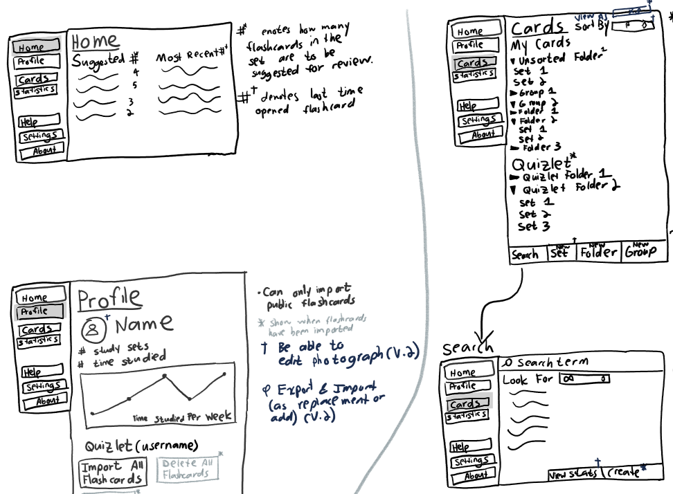
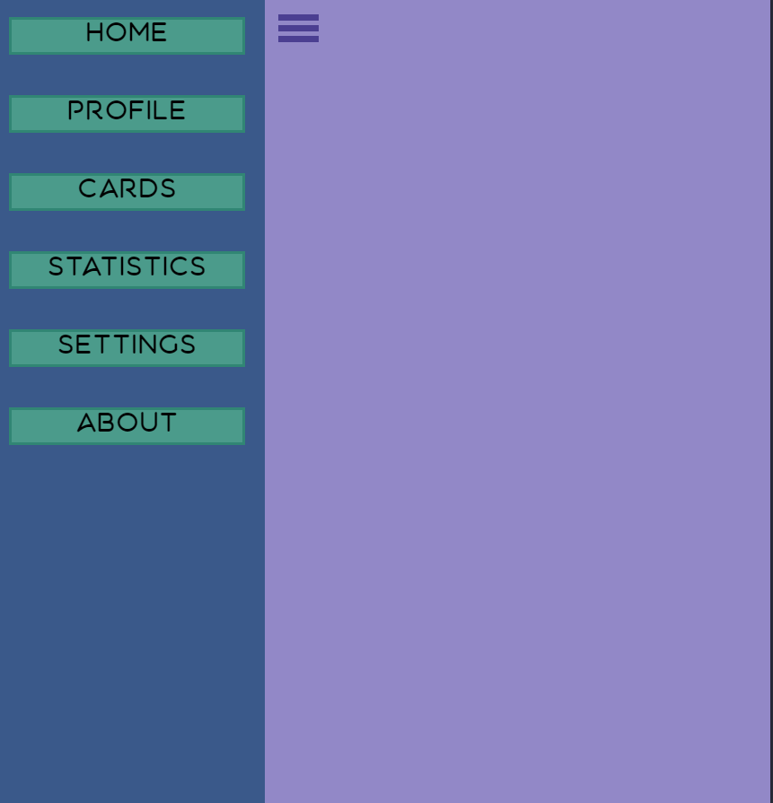
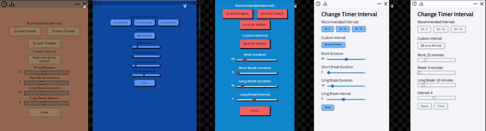
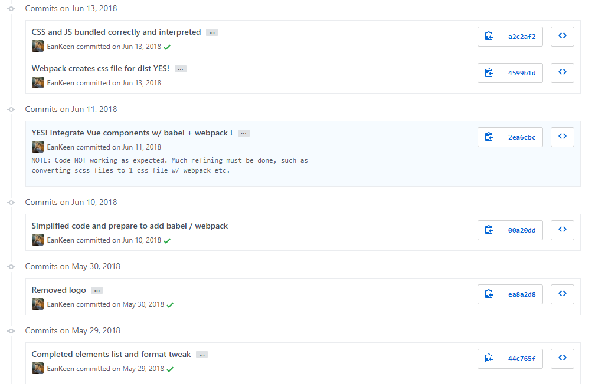
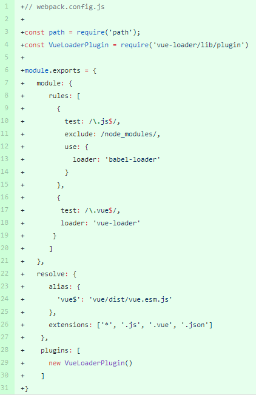
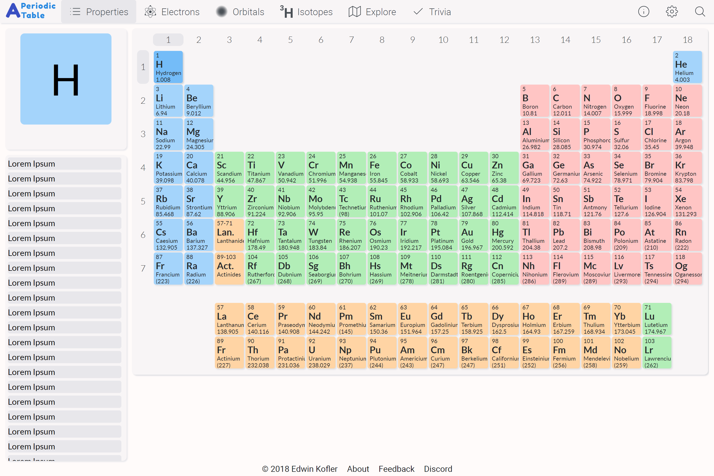

+++
title = "Frontend Web Development: My First Year"
slug = "front-end-web-dev-a-years-reflection"
author = "Edwin Kofler"
date = 2019-06-17T00:47:57-07:00
categories = ["web"]
tags = ["reflection", "frontend"]
+++

So I was reintroduced to programming during the fall of 2017. I was learning Java in my AP Computer Science A class. The class was another one of those "college-level" "advanced placement" (AP) classes, which actually became really fun near the end.

You see, I was finishing up a really fun [final project](https://github.com/hyperupcall/word-finder) (written in Java). It was basically an anagram finder, with a few extra features (including local multiplayer). I had so much fun making it. So much fun, that I had an urge to create another programming project. That's when I realized I loved programming, near the end of this Java class.

I wanted to create some program that people could use without downloading Java, or any other software. Naturally, I turned to web programming. People would only need a link to my site - no downloading required!

I did have a little experience with HTML and CSS, but that was [3 years](https://www.khanacademy.org/computer-programming/project-travel-webpage/5930419250659328) prior to the Java class. It was very basic knowledge, not even close to enough knowledge for me to execute a plan.

A month or so before summer began, I started to work on this website idea.

## Pre-Summer

### My Idea (Flashcard Application)

My first project idea consisted of a desktop app that would help students create and manage flashcards. I wanted the UI to look as good as [Quizlet](https://quizlet.com), but offer similar functionality as [Anki](https://apps.ankiweb.net) (a desktop-based flashcard app for power users (no eye candy included)).

This idea motivated me to work on some preliminary sketches of the application.

Pretty cool, huh? The sketches focused more on the menu navigation rather then the actual flashcard set. I guess it's somewhat silly brainstorming a project substantially more complex than my [previous project](https://github.com/hyperupcall/word-finder), but I really think it helped motivate me.

While brainstorming, I realized I need to know the technologies and tools to enable me to build this app. I came across [Electron](https://electronjs.org), which, in a nutshell, allows you to create a desktop app with HTML/CSS/JS. So it seems I ended up deciding not to create a website, in a traditional sense, but a desktop application (with web technologies).

This is where I learned about using git, node, npm, and electron. All that beginner stuff. Most of my knowledge was extracted from watching video tutorials, rather than official documentation or blog posts.

Everything was super foreign to me because I didn't know JavaScript. I didn't even let myself change the standard Electron boilerplate since I was afraid I could break (and not know how to fix) the app (despite using Git VCS).

After a some time, I was able to create a [lame sidebar menu](https://github.com/hyperupcall/Baeuda/tree/a05e8ee7c62ea0b44e6a29af07b723c463fd6485). Huzzah!

After I made the lame sidebar, I realized that I needed to learn more before taking on this huge "flashcard project". Since building the sidebar wasn't exactly easy, I knew that I would need more experience before continuing with the project. _D'oh!_

To gain experience, I built a Pomodoro timer.

### Pomodoro Timer

A Pomodoro timer, is basically an ordinary count-down timer, except that after every "count-down", it switches numbers it counts down from. Typically, its counts down for 25 minutes at first, but then it switches to 5 minute (for a break), then back to 25 minutes. Sometimes, longer break intervals are added in after a few short break intervals have been completed.

I called this smaller project [sigag](https://github.com/hyperupcall/sigag). Starting the project was a bit easier since I used Electron and npm before. And actually, the project turned out to be somewhat successful.

From _sigag_, I learned how to create better user interfaces.

It seemed that something finally clicked after the third or fourth iteration. It can definitely look better, but I think that most people will agree the last image is not complete garbage.

But I never finished this project idea either, like the previous project. The UI was alright, but the timer didn't actually do anything besides count down for 25 minutes, then stop. I had another idea, and was willing to do anything to work on it. But before I tell you about the idea, I'll give you some background.

## Summer

Around the time I stopped working on _sigag_, my pomodoro timer, it was nearing the end of school. There was about a month left. This is when I had that idea - a periodic table web application that looked as good as it functioned.

### Periodic Table Web App

For some background, I took a chemistry class the summer before, and used a website called [Ptable](https://ptable.com) to look up information about each atomic element. Ptable, in a way, was already a periodic table web app, but it was created in the mid-to-late 2000s. So the periodic table was way too big for phones and way to small for regular-sized computer monitors. And for me personally, the UI (and UX) was disappointing.

I extrapolated the (final) UI from my pomodoro timer app and imagined how a similar-looking UI would function as a periodic table web app. That's when I imagined my gorgeous periodic table user interface. This vision singlehandedly gave me the motivation to work on the project, especially during the more difficult parts.

I believed this new interface alone would cause people to use this hypothetical periodic table website. Since it would have mobile and tablet support. However, I wanted to differentiate my product further. I brainstormed a large list of potential features.

So I had this cool app idea. I knew what I wanted it to look like. What could go wrong? I'll tell you what happened - I tried to research how to build such an application.

That's when I started to die a bit inside. It's kind of hard to explain what it was like researching the JavaScript tooling ecosystem from the perspective of a beginner. Partly because I don't remember too much of it, and partly because I'm no longer a beginner. I looked up so many explanations on Babel, Webpack. Gulp, Grunt, Browserify, RequireJS, CommonJS, AMD, UMD, TypeScript, CoffeeScript, Sass, Less, PostCSS, Vue, React, Angular etc. I tried to understand stuff that I couldn't understand. Fundamentally, I didn't have the proper experience to completely understand it.

Somehow, I choose the right tools. I chose VueJS as a JavaScript framework and styled my components with Sass. Down the road, I began to bundle my modules with Webpack (also using Babel to transpile my JavaScript in the process).

After I chose my tools, I realized that it would be difficult to set up all the tools at once. So I just linked to the Vue CDN and started working an `index.html` file.

I started on this periodic table app on May 13, starting with the VueJS CDN. What's great is that my text editor (Atom at the time) had plugins that compiled Sass to Css and showed a live website preview. :relieved: Only now do I realize how much that helped me start my project.

About a month later I kept on adding to that HTML file until it grew to a near 100 line monstrosity. Also, I was adding a bunch of `script` tags near the end (in addition to a `main.vue` file, which was really just a plain JS file). That was the time I decided to use Webpack. Plus, my school was basically finished so I had much more free time on my hands (I knew it was going to be difficult).

:weary: I think that was the most painful moment in my life, trying to use Webpack for the first time. :weary:
[#NeverForget](https://webpack.js.org)

I'm not even joking, I think I almost died.

I don't even remember how many times I tried to get Webpack to work. I'm laughing (and dying) a bit inside just thinking about what was going on during that week. I had near-daily commits since May 30, and that week or so of "nothing" was me just trying to get Webpack to work. (that `00a20dd` commit was probably me starting from scratch again). I remember not being sure if I should even add Webpack and Babel at the same time.

The final Webpack config looked like this

It's deceivingly simple, just because that one's correct. I wish I could see all my failed attempts :joy:

Anyways, I also used Webpack to compile my Scss into Css; I set that up a week or so later.

## A month after summer

At first I began to dread using Webpack, because now I had to use loaders for my svg, font files, and similar (not to mention that I had barely had any experience using it). But later I accepted the challenge and realized its utility. I utilized as much as possible by adding `webpack-merge` to create separate development and production builds, and integrating the `UglifyJS`, `MiniCssExtractPlugin`, `OptimizeCssAssetsPlugin`, and `CopyWebpackPlugin` plugins. One thing I failed to do was export separate chunks (which would be lazily-loaded as I changed routes) with Webpack. I didn't mind failing to implement that feature because it was not completely critical.

As July turned to August, I started to refine most of my application. This was when I started harvesting data about the elements of the periodic table. I had to write some scripts in the Wolfram Language to get data about each element. That was a lot of fun :smirk:. I exported the data as a few giant JSON files. I used Gulp to transform the bundle and move stuff to the backend.

Doing the backend made me feel better about the whole project. It introduced a mechanism for code distribution, since it serves the bundled files. It was also tricky getting my frontend development server to fetch data from the backend. It was difficult looking for instructions and tutorials online because I was not experienced enough to know the proper search keywords.

It was around this time I became sort of close to burning out. You see, when school finished I poured all my available free time into building this application. At first, I was working maybe 6 hours a day, but that quickly grew to 10, then 14. The few weeks I was working 18 hours a day on the application took a huge toll. I could have gotten so much more done if I was not sleep deprived. :confused: I took a few days break after that to prevent myself from burning out. A few other sporadic breaks helped keep my sanity.

## Fall

When fall was around the corner, I realized that I couldn't finish the website before the start of school. However, I still wanted to release my application as a birthday present (early November). I ended up pushing a half-baked application to production that didn't really work. It didn't even have any data.

It basically looked something like this

All the styling is _kinda_ sexy, but I just wasn't sure how to store and manipulate the atomic data in a way which would be maintainable. Now that I reflect, I was thinking too hard about it. Since I had no experience building any other website, it was ridiculous that I thought so much about it instead of _just building it_.

Oh, and when I actually got my app to production, that's when I experienced the most fun. It felt good to put that crappy app on those DigitalOcean (my hosting provider) servers. I pulled an all-nighter configuring my Ubuntu server, getting `ssh`, `nginx`, `systemctl`, and `pm2` all configured properly. I had no idea what I was doing, which made it even more cool. And I didn't snooze off the following school day!

So getting back on track, around the time I pushed the app to production, Vue Cli 3 came out, which basically sets up Webpack, Babel, and friends automatically. That's when I decided to rewrite everything from scratch. The bundles webpack generated would be smaller and faster to load. Also, since I learned a lot about Vue that previous summer, the opportunity would allow me to make a maintainable codebase.

**Big Mistake**

When I switched to a brand new codebase (version 2), my productivity dropped significantly.

_Version 1_

_Version 2_

There was actually a few months of inactivity between my concluding work on version 1 and my preliminary work on version 2. Version 2 was a complete rewrite; you might wonder if there were other reasons from rewriting it - apart from the release of Vue Cli 3.

I knew my codebase was pretty crap and it was inefficient. The Vue components were styled inefficiently, data storage in the Vuex Store was not efficient, and the way I wrote my html was inefficient.

I wanted to fix these errors in Version 2. In fact, I did fix these issues. I wrote smaller and more modular components. I styled elements more efficiently. And, the bundles Webpack generated had a much lighter footprint.

But what was the problem?

Version 2 of the website was massively slower than the original, Even though there were less features. It was driving me nuts! Was it the fact that I was namespacing my Vuex stores? Was it because I created more components, and the child components were being re-rerendered too often? Was it the fact that I was making too many variables reactive? I had no idea and couldn't seem to find an answer. This issue effectively dissuaded me from working on the project.

It was around the end of May when I finally decided to switch back to the original code base. I had wasted 7 months. Although I learned some stuff while making Version 2, there were more efficient ways I could have learned the same content.

And that's where I'm at right now - continuing work on Version 1 of the project. It's difficult because I have so many other ideas and projects.

## Other Summer Contributions

Although I spent a significant amount of time invested in my Periodic Table application, it was not the only thing I worked on.

I made a few contributions to [Vuesax](https://lusaxweb.github.io/vuesax). It's a library for creating pretty spectacular UI components for VueJS. Because my experience with frontend development was limited, my contributions mostly consisted of documentation improvements. Contributing to VueSax helped me learn the basic Git workflows for contributing to open source projects.

## More Fall Contributions

During the fall, I started work on my [blog](https://github.com/hyperupcall/blog)! By creating the blog, I learned development workflows that did not involve nodejs or related tooling.

## Spring

In the Spring, I wanted to be able to program on my school computers with the same tools I had at home. To solve this issue, I created the [portable-workstation](https://github.com/hyperupcall/portable-workstation) repository. It uses Cmder, a portable console emulator, and hooks it up with with PowerShell Core 6.1. More recently, I've picked it back up. I finished some auto installation scripts, and I'm trying to get Scoop to integrate nicely.

Since the Spring, I joined the [repl.it](https://repl.it) community, and their [Discord chat](https://repl.it/discord). The Discord moderators decided to create a GitHub organization for people that want to contribute to community projects. One one of the first projects created was the [repl-it-electron](https://github.com/repl-it-discord/repl-it-electron) repository. Essentially, it was an electron app that displayed the repl.it website. I started contributing to that, adding some features and improving the build process. Its feature set is not substantial, but hopefully it'll have features like theming and multi-window editing soon.

[carnival](https://github.com/repl-it-discord/carnival) is another repository that's a part of the repl-it-discord GitHub organization. It's meant to show off community games created on [repl.it](https://repl.it). But even more, it's going to include leaderboards, commenting, voting systems, among many other cool features. Me and a few other community members are ramping that project up. I'll probably include it in next year's reflection.

## Next Year: Goals

I learned a lot about frontend development this year. I made a list of things that I want to learn this next year. I'm uncertain of how proficient I want to be for each element in the list, but I made some rough categories.

Advanced

- Git
- Computer networking
- Web Technologies
  - JS APIs
  - Web protocols
  - CSS, HTML

Intermediate

- Asm
- C
- Linux
  - Scripting
  - Boot process
  - Kernel magic
  - Installation
  - Customization
- Rust
- Go
- Mercurial
- Nginx
- Data structures
- TeX / LaTeX

Hopefully I'm not falling prey to the Dunning-Kruger effect - I'll be the first to admit that this list is probably sorted mostly based on relative (predicted) topical skill differences, or predicted time-to-learn values. But what are goals if they're not wrong sometimes? I guess until I dive into these topics, I won't know for sure how much I'll want to know. I'll be sure to blog about some of my learning experiences.
