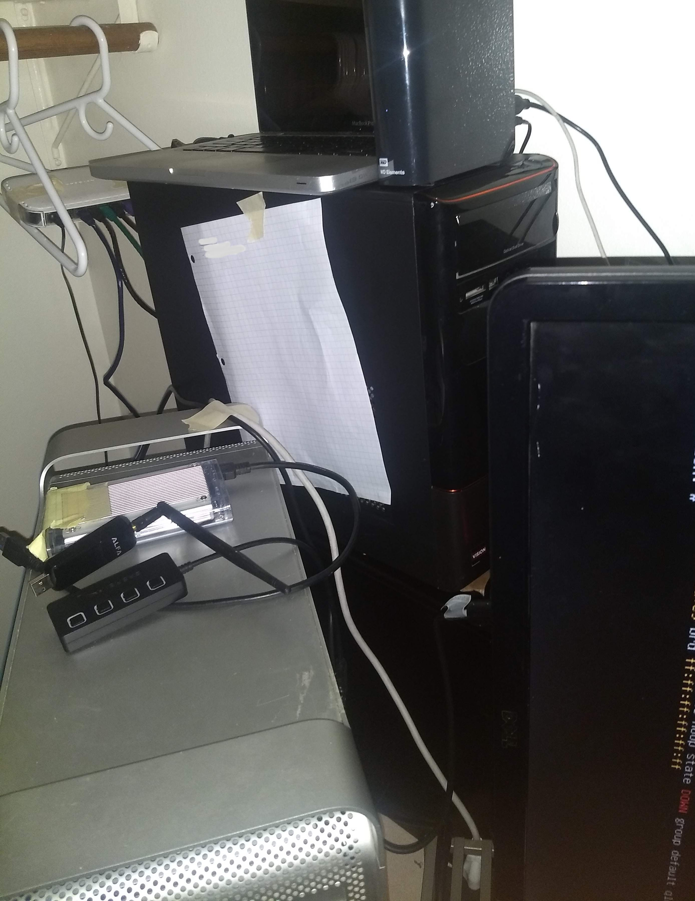

+++
title = "Fixing My Network after expanding the LAN"
slug = "fixing-my-internal-network"
author = "Edwin Kofler"
date = 2020-03-26T14:07:45-07:00
categories = ["linux"]
tags = ["linux", "network", "dhcp", "dns"]
+++

Somewhat recently, I finalized the purchase of some computers and computer parts on Craigslist. I was able to bargain for some cheap discounts - and I wanted to plug these computers into my network. Little did I know that I would be in for a wild ride...

At the time, my LAN did not consist of much: just an old (but still great!) MacBook Pro 2012, a Raspberry Pi 3B+ and a Surface Pro 5, which is my daily driver. The Pi was the only computer on the network with a statically set IP (`10.0.0.2`) because it was running my DHCP, DDNS, and DNS servers.

When it came to hooking up the new computers to my switch and router, I had no choice to unplug and rearrange _all_ my computers (space is pretty tight in a college dorm room). I had to get creative and hang my router from some hangers...



So I plugged in everything, and turned all the machines on all at once. Of course, several problems popped up. At the time, I only saw _one_ problem, which eventually caused me to misdiagnose some problems down the line.

Immediately, I ran into problems. I could not ICMP ping my router from my Surface Pro, even though I was able to do so from my Raspberry Pi. Both were connected directly to the router (not the switch). I checked the ARP table, and the mapping (for my router, `10.0.0.1`) was in a FAILED state on my Surface, but REACHABLE from my Pi. After testing the CAT 6 ethernet cable (it was still functional), I wasn't sure what else to do - so i just reset the router, which seemed to work.

But then there was another problem. I was not able to ping my Raspberry Pi from my Surface. I think I was able to ping other hosts from my Raspberry Pi though, but that doesn't make too much sense now that I think about it. It's because the Raspberry Pi's static IP address conflicted with another computer. I had planned to move the DHCP, DDNS, and DNS servers from the Pi to another computer (my trusty Macintosh G5 Tower), and I forgot the operating system I installed onto it had the same IP address. Changing the Pi's IP to prevent collisions fixed this issue.

But, you guessed it! - there were more problems. These were related to the services I was running on the Pi. The Kea DHCP4 server would no longer start. However, the issue was a simple one to fix. The configuration specified the wrong IP to listen to

```json
{
	"interfaces-config": {
		"interfaces": ["eth0/10.0.0.2"],
		"dhcp-socket-type": "raw"
	}
}
```

It was no longer `10.0.0.2`, but a separate one that did not collide with my Mac G5 Tower. Because specifying the IP address was optional in the first place, I just fixed it to `"eth0"`.

Frustratingly, BIND9 DNS _also_ stopped working, for a similar reason.

```properties
include "/usr/local/etc/bind/named.conf.log";

options {
  directory "/usr/local/var/cache/bind";

  listen-on port 53 { 10.0.0.2; };
  listen-on-v6 port 53 { ::1; };
}
...
```

At first, I changed the IP address to the loopback interface `127.0.0.1`. That didn't work because I forgot the loopback interface is not associated with an actual hardware component that can be connected to from the reset of the network. I changed it to the actual IP address of the Pi (`10.0.0.10`).

And lastly, there is one more issue that I almost forgot to mention. Inside of some `option-data` in my Kea DHCP server, it was configured to continue broadcasting the old Domain Name Server IP.

```json
{
	"name": "domain-name-servers",
	"code": 6,
	"space": "dhcp4",
	"csv-format": true,
	"data": "10.0.0.2"
}
```

Of course, I did not want to give the clients to my DHCP server the wrong IP address, so I had to change that as well.

So in conclusion, after changing my network topology, I faced several issues:

- Could not ping my router (router bugged?)
- Two devices on the network had the same IP address
- DHCP servers were listening on the correct interface, but at the wrong (old) IP address
- DNS servers were listening on the wrong (old) IP address
- DHCP servers were broadcasting the old IP of the DNS servers

The one key takeaway I learned is that it's a terrible idea to update / change operating systems (especially multiple at once!) while simultaneously changing the network topology.
