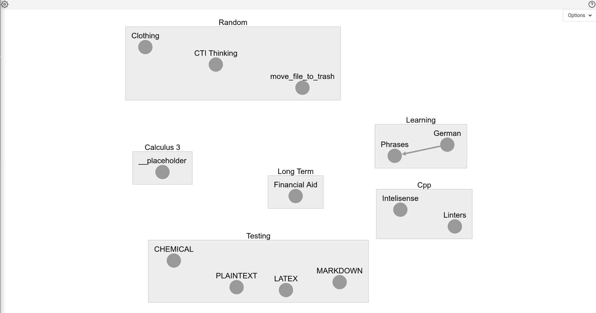
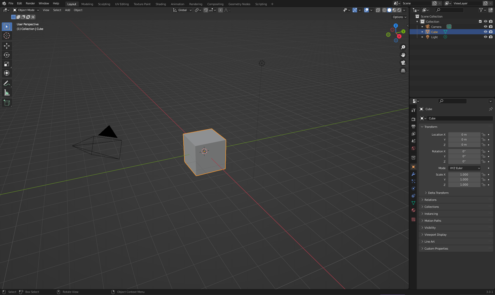
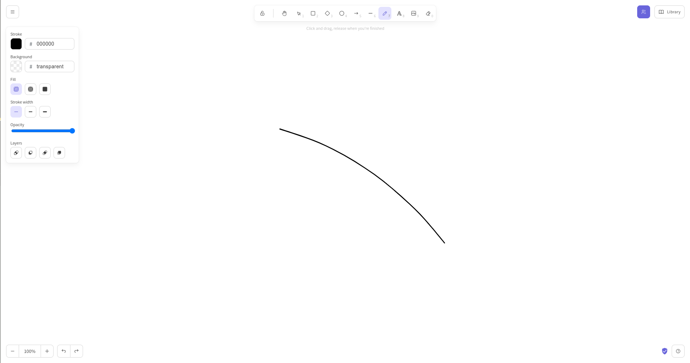

+++
title = "Mouse Control"
slug = "mouse-control"
author = "Edwin Kofler"
date = 2023-03-30T15:13:14-07:00
categories = []
tags = []
+++

Similar to [Semantic Hotkeys](/posts/semantic-hotkeys), this posts analyses how mouse controls are used in complex applications.

While working on [Quazipanacea](https://github.com/quazipanacea), I found myself implementing controls for a graph:

To make intuitive controls to pan, select multiple nodes, draw edges and more, I decided to document how other complex software handles multi-modal controls.

## Blender

### Blender Mouse Buttons

| Key                    | Action        |
|------------------------|---------------|
| Left-click             | Select Square |
| Left-click + Shift     | Select Square |
| Left-click + Control   | Select Square |
| Right-click            | Context Menu  |
| Right-click + Shift    | Move Target   |
| Right-click + Control  | Select Lasso  |
| Middle-click           | Rotate        |
| Middle-click + Shift   | Pan           |
| Middle-click + Control | Zoom          |
| Scroll-wheel           | Zoom          |
| Scroll-wheel + Shift   | Nothing       |
| Scroll-wheel + Control | Nothing       |

### Blender Context Menu

Blender's context menu adapts to the current context (Object, Edit/Vertex, Edit/Edge, Edit/Face).

Move of them have the same cut/copy/paste, duplicate, delete, but of course there are context-specific items.

## Excalidraw

### Excalidraw Mouse Buttons

| Key                    | Action            |
|------------------------|-------------------|
| Left-click             | Draw              |
| Left-click + Shift     | Draw              |
| Left-click + Control   | Draw              |
| Right-click            | Context Menu      |
| Right-click + Shift    | Context Menu      |
| Right-click + Control  | Context Menu      |
| Middle-click           | Pan               |
| Middle-click + Shift   | Pan               |
| Middle-click + Control | Pan               |
| Scroll-wheel           | Vertical Scroll   |
| Scroll-wheel + Shift   | Horizontal Scroll |
| Scroll-wheel + Control | Zoom              |
