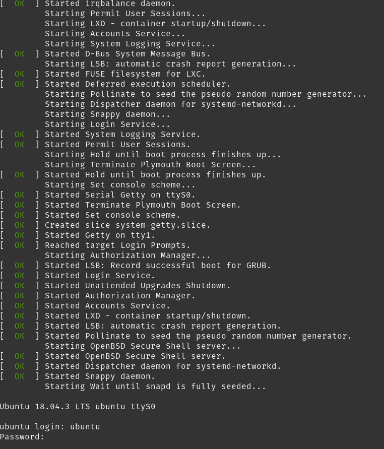

+++
title = "Using Cloud Init"
slug = "using-cloud-init"
author = "Edwin Kofler"
date = 2020-01-27T17:58:23-08:00
categories = []
tags = []
+++

I found myself needing to use cloud-init to automate the configuration of virtual machines and machine containers. I wanted to login information and ssh authentication for pre-defined users. I remember being rather confused and frusterated with my initial (and future) dealings with cloud-init. This guide will show you how to use it, starting from step zero, and some silly hung-ups I experienced.

Because I was using Ubuntu, I knew I needed to get some Ubuntu image somewhere compatable with cloud init. I also new I had to write yaml files to declaratively state the stae of my machine, but it was hard finding a path to completion.

## Finding Ubuntu Images

First, you need some 'base' image to use `cloud-init` on. Instead of downloading an [Ubuntu server](https://ubuntu.com/download/server) image, download an [Ubuntu cloud](https://ubuntu.com/download/cloud) image instead. If you're skimming the website, it's super easy to miss the [link](https://cloud-images.ubuntu.com). Cloud images are similar to Server images, except they do not contain the ncurses-based manual installation menus. This means that once you `dd` the image to a partition, it'll boot into a serial console.

I'll be downloading [Ubuntu bionic](https://cloud-images.ubuntu.com/bionic/current/bionic-server-cloudimg-amd64.tar.gz).

Extract the contents

```sh
tar -xzf bionic-server-cloudimg-amd64.tar.gz
# => bionic-server-cloudimg-amd64.img
```

## Using Qemu to start the image

I will be invoking commands that create a virtual machine using the kvm hypervisor. I'll be using the `virsh` command to manage these virtual machines, which comes with the `libvirt-clients` package.

Install qemu, libvirt, and necessary virtualization software

```sh
sudo apt-get install qemu-kvm libvirt-daemon-system libvirt-clients bridge-utils
```

`libvirt` is a utility written in C for managing virtual machines of different types. `virsh` uses this interface

```sh
# lists active domains, or running virtual machines
virsh list

# lists active and inactive domains
virsh list --all
```

Before we create a virtual machine, let's get some information about the image we plan to use

```sh
$ qemu-img info bionic-server-cloudimg-amd64.img
image: bionic-server-cloudimg-amd64.img
file format: qcow2
virtual size: 2.2G (2361393152 bytes)
disk size: 329M
cluster_size: 65536
Format specific information:
    compat: 0.10
    refcount bits: 16
```

wow! so our image is in the `qcow2` format. it's a disk image format used by qemu. it's good at efficiently storing data, among a bunch of other things. when troubleshooting issues, i found it quite useful to know what format the image is in.

Copy the original image.

```sh
cp bionic-server-cloudimg-amd64.img bionic-server-cloudimg-amd64.qcow2
```

I like to convert my `qcow2` image to raw format.

```sh
qemu-img convert \
  -f qcow2 bionic-server-cloudimg-amd64.qcow2 \
  -O raw bionic.img \
  -p
```

note that once you use `bionic.img` in a `virt-install` script, that image will be continued to be written by virsh etc. so be sure to use a new one every time (ex. generate one with qemu-img convert). (i have a script later below)

```sh
virt-install \
  --name ubuntu-image \
  --disk bionic.img,device=disk,bus=virtio \
  --os-variant ubuntu18.04 \
  --network default \
  --memory 2048 \
  --graphics none \
  --virt-type kvm \
  --hvm \
  --import
```

now, we got it. "ctrl + [" to exit



you will notice that you don't see any cloud-init output; just systemd.

## Adding Clout Init to the Image

Now for the fun part, adding cloud init to the image.

First, create a `user.yml` file and fill it with

```yml
#cloud-config
password: arrow
chpasswd: { expire: false }
ssh_pwauth: true
```

Then, create a `meta.yml` and fill it with

```yml
instance-id: 60a5a5b4-5c2f-4b7c-ade5-1d07483a2725
```

we then create a `seed.img` from that

```sh
cloud-localds -d raw seed.img user.yml meta.yml
```

```sh
qemu-img convert \
  -f qcow2 bionic-server-cloudimg-amd64.qcow2 \
  -O raw cloud-init-bionic.img \
  -p
```

```sh
virt-install \
  --name cloud-init-ubuntu-image \
  --memory 2048 \
  --disk cloud-init-bionic.img,device=disk,bus=virtio \
  --disk seed.img,device=cdrom \
  --virt-type kvm \
  --graphics none \
  --os-variant ubuntu18.04 \
  --network default \
  --import \
  --hvm
```

you will see that now you can login with the username `ubuntu` and the password `arrow`

once you list your virtual machines with `virsh list --all`, you will find that they are likely still runnign or turned off. to remove then, first

```sh
virsh destroy --graceful cloud-init-ubuntu-image
virsh undefine cloud-init-ubuntu-image
```

script for fast testing

```sh
#!/bin/sh
rm -f seed.img
cloud-localds -d raw seed.img user.yml meta.yml

virsh destroy --graceful new
virsh undefine new

rm -f bionic.img
qemu-img convert -f qcow2 bionic-server-cloudimg-amd64.qcow2 -O raw bionic.img -p

virt-install \
  --name new \
  --memory 2048 \
  --disk bionic.img,device=disk,bus=virtio \
  --disk seed.img,device=cdrom \
  --virt-type kvm \
  --graphics none \
  --os-variant ubuntu18.04 \
  --network bridge=br0 \
  --import \
  --hvm
```
